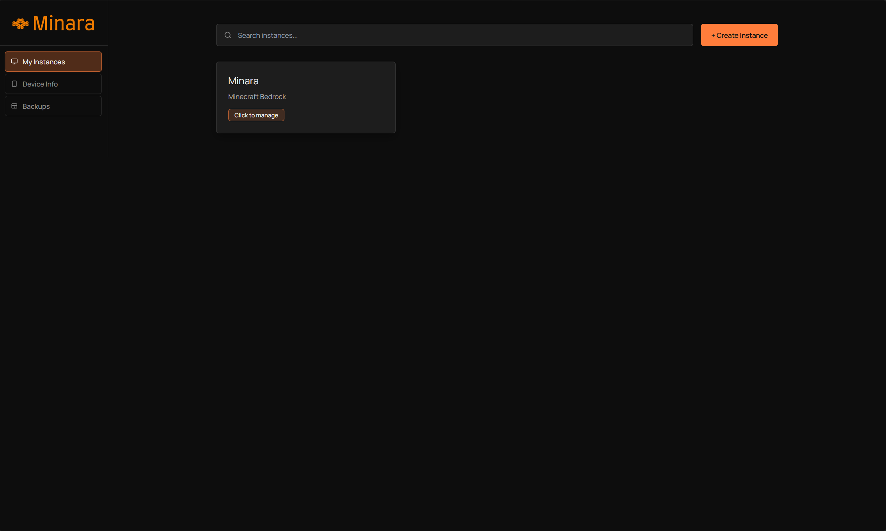
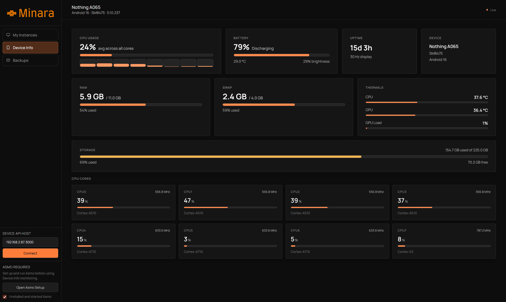
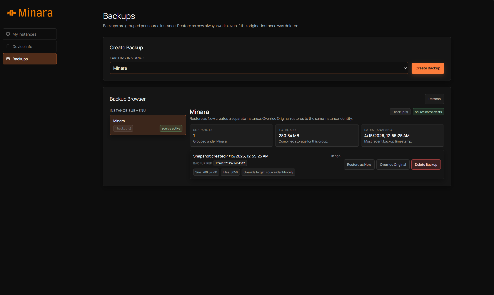
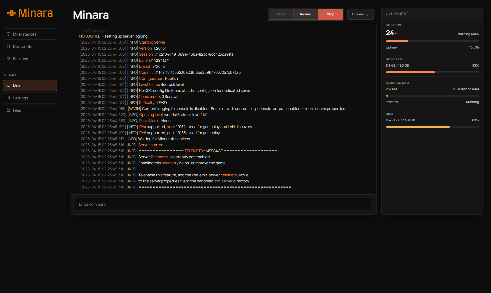
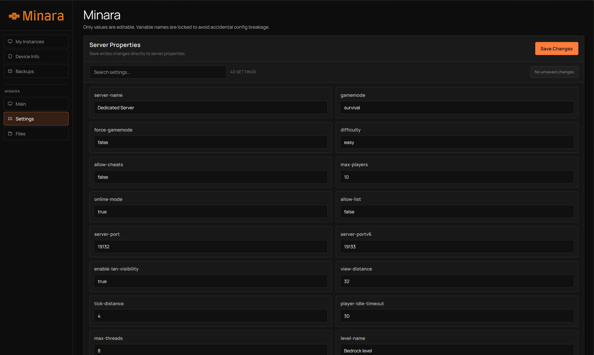
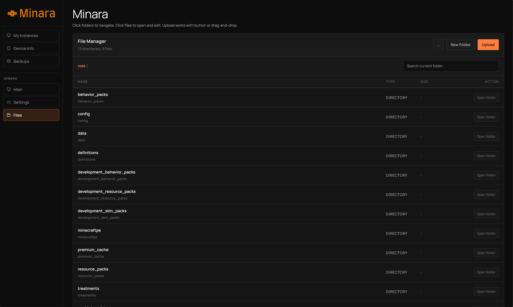
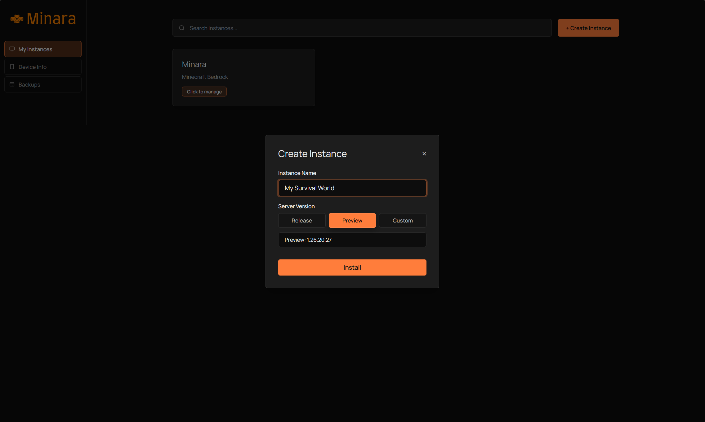

<p align="center">
  
</p>

<h1 align="center">Minara</h1>
<p align="center"><strong>Version 2.0.0</strong></p>
<p align="center">
  A modern, Rust-powered control panel for managing
  <strong>Minecraft Bedrock Dedicated Server</strong> instances on Android using Termux.
</p>

<p align="center">
  
  
  
  
</p>

<p align="center">
  
  
  
  
  
</p>

---

## Why Minara

Minara is the web-panel generation of this project line: a clean operational interface for creating, running, monitoring, and maintaining multiple Minecraft Bedrock server instances with a workflow that is practical on Android.

It is designed for users who want:

- Multi-instance management from one control plane
- Real-time console and monitoring
- Backup and restore with identity safety checks
- Native Rust performance with a polished web UX
- ARM64 compatibility through bionilux/Box64 workflows

---

## Highlights

- Full server lifecycle control: start, stop, status, command input
- Multi-instance management: create, rename, delete, browse
- Live console streaming via SSE
- Device monitoring integration with Asmo
- Host metrics: CPU, memory, disk, uptime, load average
- Built-in file manager: upload, edit, create folders, download
- Backup and restore with lineage-aware identity handling
- Dedicated development mode (`-d`) and production mode behavior
- Persistent storage at `~/.local/share/minara`

---

## UI Showcase
### Overview Panels

<p align="center">
  
  
</p>

<p align="center">
  
  
</p>

<p align="center">
  
  
</p>

<p align="center">
  
</p>

---

## Architecture At A Glance

Minara uses a Rust async web architecture:

- Backend: Axum + Tokio
- Templates: Askama
- Data flow: API endpoints + SSE log streaming
- Runtime integrations: Asmo (device stats), bionilux (server launch path), Box64 (ARM64 translation path)

### Runtime Flow

1. Minara boots on port `7777`
2. Minara ensures data directories exist in `~/.local/share/minara`
3. It detects and lists existing instances
4. You create/start instances from the panel
5. Server process runs (`bedrock_server` via `bionilux`)
6. Console logs stream to UI in real time
7. Monitoring pulls host stats and device stats (Asmo)
8. Backups are created/restored with metadata and identity checks

---

## Components

| Component | Purpose |
| --- | --- |
| Dashboard | Entry point, instance list, creation flows |
| Console | Live logs, command input, runtime controls |
| Settings | `server.properties` editing per instance |
| Files | File browser and in-panel file operations |
| Device Info | Asmo-aware monitoring and device-source handling |
| Backups | Create, restore, and manage instance backups |

---

## Asmo + bionilux + Box64 Integration

### Asmo

Minara can fetch device metrics from Asmo (default source `localhost:3000`):

- Startup checks Asmo readiness and reports status
- Device Info includes setup guidance and explicit readiness UX
- Monitoring source behavior is mode-aware

Asmo project: https://github.com/theonuverse/asmo

### bionilux and Box64

Minecraft Bedrock server binaries are AMD64-oriented in many real-world workflows.
On ARM64 hosts (common in Android environments), Minara integrates bionilux-based launching to support these deployments.

- Production mode: requires `bionilux` in `PATH`
- Development mode (`-d`):
  - `aarch64`: requires `bionilux`
  - `x86_64`: can run `bedrock_server` directly on Linux host

Runtime note:

- When Minara launches via `bionilux`, it sets `BIONILUX_WAKELOCK=1`.

---

## Installation

### 1) Quick Install (One-Liner)

```bash
curl -sL theonuverse.github.io/minara/setup | bash
```


### 2) Build From Source (Termux)

```bash
# Update packages
yes | pkg up

# Install dependencies
pkg install git rust -y

# Clone the repo
git clone https://github.com/theonuverse/minara.git
cd minara

# Build
cargo build --release

# Install into Termux PATH
cp target/release/minara $PREFIX/bin/
```

Run Minara:

```bash
minara
```

Or development mode:

```bash
minara -d
```

### 3) Binary Usage (Manual)

If you already have a Minara binary file:

```bash
chmod +x minara
cp minara $PREFIX/bin/
minara
```

---

## First Run Checklist

1. Start Minara.
2. Open panel at `http://<your-private-ip>:7777`.
3. Create an instance with a valid Bedrock version.
4. Start the instance and open Console.
5. Confirm monitoring in Device Info (install/start Asmo if needed).
6. Create your first backup.

---

## Runtime Modes

| Mode | Behavior |
| --- | --- |
| Production (default) | Fixed device source path behavior and bionilux-required launch strategy |
| Development (`-d`) | Device source can be edited in UI; launch path is architecture-aware |

---

## Data Layout

Minara persists state in:

```text
~/.local/share/minara/
  instances/
  backups/
```

This makes operation independent of the current working directory.

---

## API Surface (Selected)

| Endpoint | Method | Purpose |
| --- | --- | --- |
| `/api/create-instance` | POST | Create a new server instance |
| `/instance/{name}/start` | POST | Start server process |
| `/instance/{name}/stop` | POST | Stop server process |
| `/instance/{name}/stream` | GET | Live console stream (SSE) |
| `/api/instance/{name}/files/upload` | POST | Upload files |
| `/api/backups` | GET/POST | List and create backups |
| `/api/backups/{id}/restore` | POST | Restore backup |
| `/api/device-stats` | GET | Pull Asmo/device metrics |
| `/api/host-stats` | GET | Host monitoring metrics |

---

## Troubleshooting

### Port 7777 already in use

Stop the conflicting process or change your environment so Minara can bind to `0.0.0.0:7777`.

### bionilux not found

Install bionilux and ensure it is available in `PATH`.

### Device metrics unavailable

Install/start Asmo and verify it responds on the configured source (default `localhost:3000`).

### Instance creation or download fails

Check internet access and confirm the requested Bedrock version exists.

---

## Termux Notes

- Minara is designed to support Android-oriented workflows through Termux-compatible setups.
- For ARM64 Android environments, bionilux/Box64 compatibility paths are essential for Bedrock execution.
- Use a stable userspace setup and ensure required binaries are executable.

---

## Project Status

Minara `v2.0.0` is the active generation of this project and serves as the upgraded management experience for Bedrock operations.

For rename and architecture migration notes, see [changelog.md](changelog.md).

---

## Contributing

Contributions are welcome.

Suggested contribution areas:

- More diagnostics and observability endpoints
- Better screenshot and docs quality
- Better design for mobile aspect ratio

---

## License

MIT License. See [LICENSE](LICENSE).

---

<p align="center">
  Built with focus and care for the Bedrock self-hosting community.
</p>
